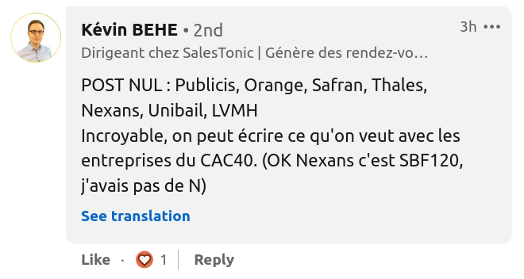

# Acronymes-CAC40

Un commentaire à un de mes posts LinkedIn m’a donné envie de coder la réponse:
"Quels sont tous les acronymes que l’on peut générer à partir des initiales des noms de sociétés du CAC40 ?"

On va y répondre en quelques étapes





1) Sortir le compte des lettres de chaque initiale du CAC40

On sait qu’il y a 7 S par exemple !

2) Filtrer les mots francais de longueur >= 6 (pour avoir des mots intéressants)

438401 de longueur > 6 dans le dictionnaire tout de même

3) Trouver les mots que l’on peut former avec les contraintes CAC40

11215 mots sont possibles avec le CAC40, mais à ce stade on a beaucoup de mots sont des doublons. Exemple:
 'vapoteur',
 'vapoteurs',
 'vapoteuse',
 'vapoteuses',

Ce serait bien d’élaguer, c’est ce qu’on va faire

4) Supprimer les mots similaires.

On va extraire les racines communes, puis prendre le mot le plus long. Exemple des mots ayant comme racine "slalom" que l’on pourrait générer:

 'slalom': ['slalom',
            'slaloma',
            'slalomas',
            'slalomasse',
            'slalomasses',
            'slalome',
            'slalomer',
            'slalomera',
            'slalomeras',
            'slalomes',
            'slalomeuse',
            'slalomeuses',
            'slaloms'],

On prend le plus long. Ce n’est pas la meilleur métrique pour filtrer, mais c’est simple à mettre en oeuvre

5) Affichage

```
Avec les initiales du CAC40, on peut former 3656 mots de plus de 6 lettres
tel que (au hasard ^^):

carpettes
cartels
caveau
chevretasses
cradots
crapauds
daurades
kleptocrates
lavabos
leadeurs
maboules
maladresses
sucettes
thermostables
waterballasts
```

# Installation & utilisation

```bash
pip install requirements.txt
python main.py
```

# License

Ce projet est sous license MIT.

Le fichier `mots.txt` est repris du projet [SUTOM](https://framagit.org/JonathanMM/sutom) (license MIT) que l’on peut trouver là:

https://framagit.org/JonathanMM/sutom/-/tree/main/data